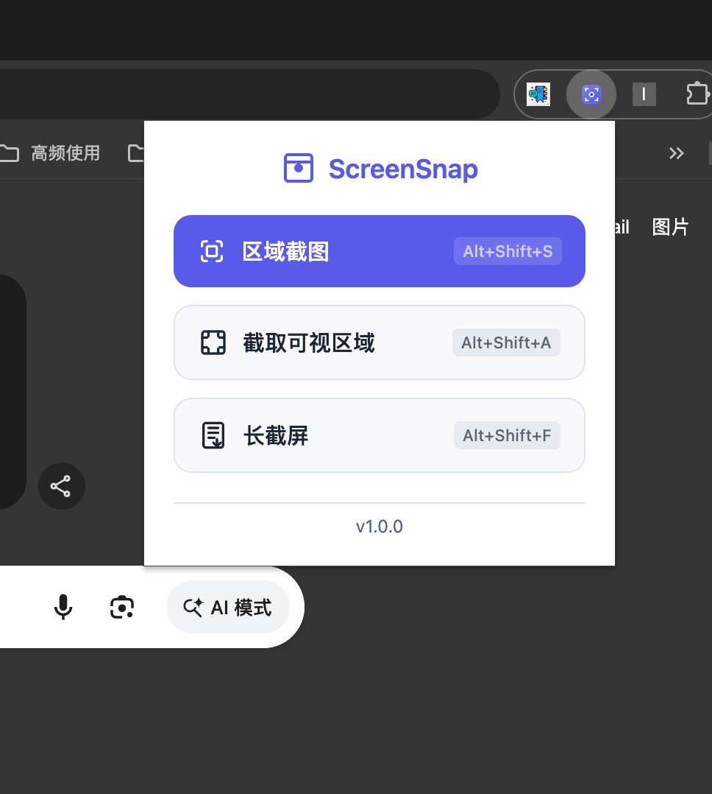
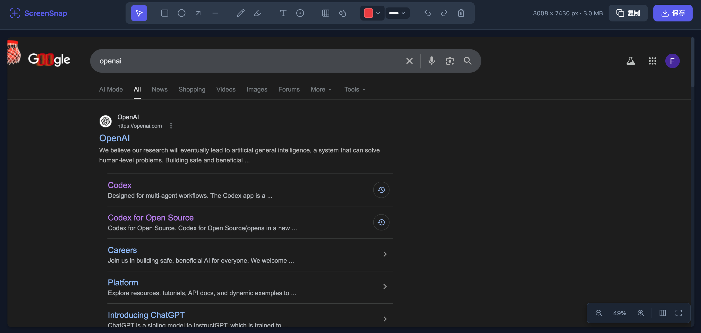

# ScreenSnap

[中文](#中文) | [English](#english)

---

<a id="中文"></a>

一款简洁高效的 Chrome 截图扩展，支持区域截图、可视区域截图、全页长截图和 GIF 录制，内置标注编辑器。


## 截图预览

<table>
  <tr>
    <td align="center" width="300">
      
      <br /><b>弹窗菜单</b>
    </td>
    <td align="center">
      
      <br /><b>标注编辑器 + 长截屏</b>
    </td>
  </tr>
</table>

## 功能特性

### 截图模式

| 模式 | 快捷键 | 说明 |
|------|--------|------|
| 区域截图 | `Alt+Shift+S` | 拖拽选区，精确截取任意区域 |
| 可视区域 | `Alt+Shift+A` | 一键截取当前浏览器可视区域 |
| 长截屏 | — | 自动滚动拼接，截取完整页面 |
| GIF 录制 | `Alt+Shift+G` | 选区录制动画 GIF |

### 标注编辑器

截图后自动打开标注编辑器，支持：

- **形状工具** — 矩形、椭圆、箭头、直线
- **画笔工具** — 自由绘制、荧光笔
- **文字标注** — 添加文字说明
- **序号标注** — 添加编号标记
- **隐私保护** — 马赛克、模糊遮挡敏感信息
- **颜色/线宽** — 12 种预设颜色 + 自定义色 + 4 种线宽
- **撤销/重做** — 完整操作历史
- **缩放控制** — 滚轮缩放、适应宽度、适应窗口
- **导出** — 复制到剪贴板 / 下载 PNG

### GIF 录制

- 拖拽选区录制，最长 15 秒
- Median-cut 色彩量化 + Floyd-Steinberg 抖动
- 每帧独立调色板（Local Color Table），色彩精准
- 原生分辨率，无缩放模糊

### 长截屏技术亮点

- 智能重叠滚动拼接，自动消除 sticky/fixed 头部重复
- 无限滚动页面检测与自动捕获
- Service Worker 保活机制，防止长时间截取中断
- API 限频自动重试

## 安装

### 从源码安装（开发模式）

1. 克隆仓库：
   ```bash
   git clone https://github.com/JackCaow/screensnap.git
   ```

2. 打开 Chrome，进入 `chrome://extensions/`

3. 开启右上角「开发者模式」

4. 点击「加载已解压的扩展程序」，选择项目目录

### 从 Chrome Web Store 安装

> 即将上架，敬请期待。

## 快捷键自定义

Chrome 浏览器中进入 `chrome://extensions/shortcuts`，可自定义各截图模式的快捷键。

## 浏览器兼容

- Chrome 88+（Manifest V3）
- Edge 88+（Chromium 内核）

## 许可证

[MIT](LICENSE)

---

<a id="english"></a>

# ScreenSnap

A clean, efficient Chrome screenshot extension with region capture, visible area capture, full-page scrolling capture, and GIF recording — with a built-in annotation editor.


## Screenshots

<table>
  <tr>
    <td align="center" width="300">
      
      <br /><b>Popup Menu</b>
    </td>
    <td align="center">
      
      <br /><b>Annotation Editor + Full Page</b>
    </td>
  </tr>
</table>

## Features

### Capture Modes

| Mode | Shortcut | Description |
|------|----------|-------------|
| Region | `Alt+Shift+S` | Drag to select and capture any area |
| Visible Area | `Alt+Shift+A` | Capture the current browser viewport |
| Full Page | — | Auto-scroll and stitch the entire page |
| GIF Recording | `Alt+Shift+G` | Record a selected region as animated GIF |

### Annotation Editor

A full-featured editor opens automatically after capture:

- **Shapes** — Rectangle, ellipse, arrow, line
- **Drawing** — Freehand pen, highlighter
- **Text** — Add text annotations
- **Numbering** — Add numbered markers
- **Privacy** — Mosaic and blur to redact sensitive info
- **Color / Stroke** — 12 preset colors + custom picker + 4 stroke widths
- **Undo / Redo** — Full action history
- **Zoom** — Scroll zoom, fit width, fit view
- **Export** — Copy to clipboard / download PNG

### GIF Recording

- Drag to select recording region, up to 15 seconds
- Median-cut color quantization + Floyd-Steinberg dithering
- Per-frame Local Color Table for accurate colors
- Native resolution, no downscaling blur

### Full Page Capture

- Smart overlap-based stitching that removes sticky/fixed header duplication
- Infinite scroll detection and auto-capture
- Service Worker keep-alive to prevent interruption during long captures
- Automatic rate-limit retry

## Installation

### From Source (Developer Mode)

1. Clone the repository:
   ```bash
   git clone https://github.com/JackCaow/screensnap.git
   ```

2. Open Chrome and go to `chrome://extensions/`

3. Enable **Developer mode** (top right)

4. Click **Load unpacked** and select the project directory

### From Chrome Web Store

> Coming soon.

## Customize Shortcuts

Go to `chrome://extensions/shortcuts` in Chrome to customize keyboard shortcuts.

## Browser Compatibility

- Chrome 88+ (Manifest V3)
- Edge 88+ (Chromium-based)

## License

[MIT](LICENSE)
